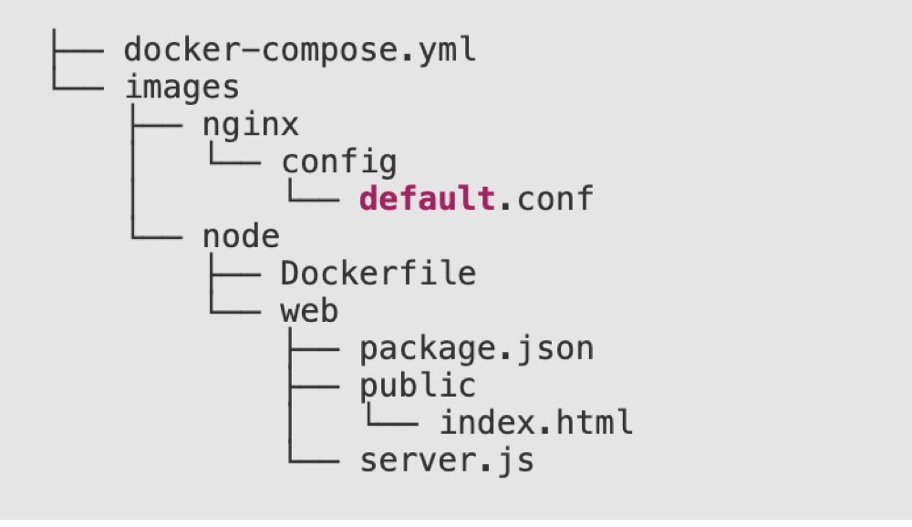

# 10. node项目
- nodeapp 是一个用 Docker 搭建的本地 Node.js 应用开发与运行环境。

## 10.1 服务分类

- db：使用 `mariadb` 作为应用的数据库
- node：启动`node`服务
- web：使用 `nginx` 作为应用的 web 服务器

## 10.2 app目录结构

|文件|说明|
|----|----|
|docker-compose.yml	|定义本地开发环境需要的服务|
|images/nginx/config/default.conf	|nginx 配置文件|
|images/node/Dockerfile	|node的Dockfile配置文件|
|images/node/web/package.json	|项目文件|
|images/node/web/public/index.html	|静态首页|
|images/node/web/server.js	|node服务|



## 10.2.1 docker-compose.yml

```sh
version: '2'
services:
 node:
  build:
    context: ./images/node
    dockerfile: Dockerfile
  depends_on:
   - db
 web:
  image: nginx
  ports:
   - "8080:80"
  volumes:
   - ./images/nginx/config:/etc/nginx/conf.d
   - ./images/node/web/public:/public  
  depends_on:
   - node
 db:
  image: mariadb
  environment:
   MYSQL_ROOT_PASSWORD: "root"
   MYSQL_DATABASE: "node"
   MYSQL_USER: "zfpx"
   MYSQL_PASSWORD: "123456"
  volumes:
    - db:/var/lib/mysql
volumes:
 db:
  driver: local
```

## 10.2.2 sever.js
images/node/web/server.js

```sh
let http=require('http');
var mysql  = require('mysql');
var connection = mysql.createConnection({
  host     : 'db',
  user     : 'zfpx',
  password : '123456',
  database : 'node'
});

connection.connect();

let server=http.createServer(function (req,res) {
    connection.query('SELECT 2 + 2 AS solution', function (error, results, fields) {
        if (error) throw error;
        res.end(''+results[0].solution);
    });
});
server.listen(3000);
```

## 10.2.3 package.json
images/node/web/package.json

```sh
{
"scripts": {
    "start": "node server.js"
  },
"dependencies": {
    "mysql": "^2.16.0"
}
```

## 10.2.4 images/node/Dockerfile

```sh
FROM node
MAINTAINER zhangrenyang <zhang_renyang@126.com>
COPY ./web /web
WORKDIR /web
RUN npm install
CMD npm start
```

## 10.2.5 images/nginx/config/default.conf 

```sh
upstream backend {
    server node:3000;
}
server {
    listen 80;
    server_name localhost;
    root /public;
    index index.html index.htm;

    location /api {
        proxy_pass http://backend;
    }
}
```


