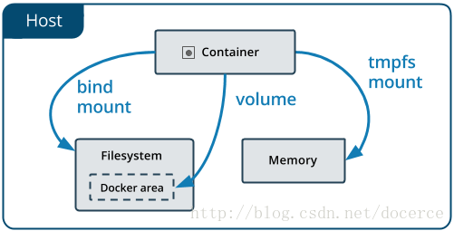

# 7.数据盘
- 删除容器的时候，容器层里创建的文件也会被删除掉，如果有些数据你想永久保存，比如Web服务器的日志，数据库管理系统中的数据，可以为容器创建一个数据盘



## 7.1 volume 

- volumes Docker管理宿主机文件系统的一部分(/var/lib/docker/volumes)
- 如果没有指定卷，则会自动创建
- 建议使用--mount ,更通用

## 7.1.1 创建数据卷

```sh
docker volume --help
docker volume create nginx-vol
docker volume ls
docker volume inspect nginx-vol
```

```sh
#把nginx-vol数据卷挂载到/usr/share/nginx/html,挂载后容器内的文件会同步到数据卷中
docker run -d  --name=nginx1 --mount src=nginx-vol,dst=/usr/share/nginx/html nginx
docker run -d  --name=nginx2  -v nginx-vol:/usr/share/nginx/html -p 3000:80 nginx
```

## 7.1.2 删除数据卷

```sh
docker container stop nginx1 停止容器
docker container rm nginx1 删除容器
docker volume rm nginx-vol  删除数据库
```

## 7.1.3 管理数据卷
```sh
docker volume ls #列出所有的数据盘
docker volume ls -f dangling=true #列出已经孤立的数据盘
docker volume rm xxxx #删除数据盘
docker volume ls      #列出数据盘
```

## 7.2 Bind mounts
- 此方式与Linux系统的mount方式很相似，即是会覆盖容器内已存在的目录或文件，但并不会改变容器内原有的文件，当umount后容器内原有的文件就会还原
- 创建容器的时候我们可以通过`-v`或`--volumn`给它指定一下数据盘
- `bind mounts` 可以存储在宿主机系统的任意位置
- 如果源文件/目录不存在，不会自动创建，会抛出一个错误
- 如果挂载目标在容器中非空目录，则该目录现有内容将被隐藏

## 7.2.1 默认数据盘

- -v 参数两种挂载数据方式都可以用

```sh
docker run -v /mnt:/mnt -it --name logs centos bash
cd /mnt
echo 1 > 1.txt
exit

```

```sh
docker inspect logs
"Mounts": [
    {
        "Source":"/mnt/sda1/var/lib/docker/volumes/dea6a8b3aefafa907d883895bbf931a502a51959f83d63b7ece8d7814cf5d489/_data",
        "Destination": "/mnt",
    }
]
```

- `Source` 的值就是我们给容器指定的数据盘在主机上的位置
- `Destination` 的值是这个数据盘在容器上的位置

## 7.2.2 指定数据盘

```sh
docker run -v ~/data:/mnt -it --name logs2 centos bash
cd /mnt
echo 3 > 3.txt
exit
cat ~/data/3.txt
```

- ~/data:/mnt 把当前用户目录中的data目录映射到/mnt上

## 7.2.3 指定数据盘容器
- docker create [OPTIONS] IMAGE [COMMAND] [ARG...] 创建一个新的容器但不启动

```sh
docker create -v /mnt:/mnt --name logger centos
docker run --volumes-from logger --name logger3 -i -t centos bash
cd /mnt 
touch logger3
docker run --volumes-from logger --name logger4 -i -t centos bash
cd /mnt
touch logger4

```
