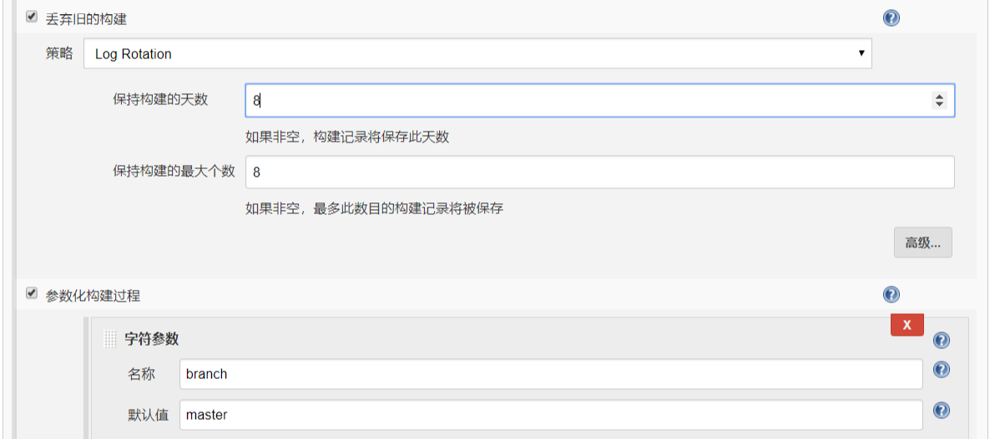
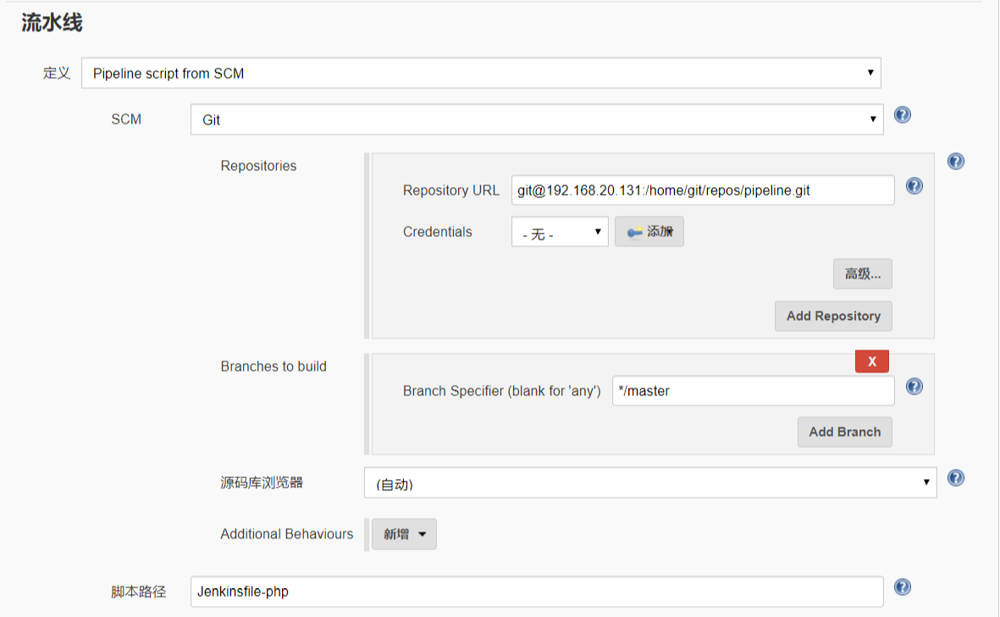

# 10.发布PHP项目

## 10.1 创建本地项目

- 先登录git服务器创建php仓库

```js
mkdir -p /home/git/repos/dev-php.git
cd /home/git/repos/dev-php.git
git init --bare
```

## 10.2 拉取代码

- 拉取并初始化本地仓库

```js
git clone  git@192.168.20.131:/home/git/repos/dev-php.git
cd php
echo "<?php echo info()?>" > index.php
git add -A
git commit -m"add index.php"
git push origin master
```

## 10.3 部署环境

- 安装php
- 安装nginx


## 10.4 创建项目

## 10.4.1 构建参数

  
  

## 10.4.2 pipeline脚本 
- 先在git服务器里创建一个dev-php项目
- 然后到web服务器上克隆此项目并在里面添加文件
- 在pipeline服务器里添加新的脚本
- 给web服务器添加标签名并在pipeline脚本中引用

- web服务器上的工作目录 /var/lib/jenkins/workspace/dev-php

- credentialsId git/git

cat /root/pipeline/Jenkinsfile-php

```js
node('webserver') {
    stage ('checkout'){
       checkout([$class: 'GitSCM', branches: [[name: '*/master']], doGenerateSubmoduleConfigurations: false, extensions: [], submoduleCfg: [], userRemoteConfigs: [[credentialsId: '8e8e63f9-4806-4f2e-8633-c92badbdefd7', url: "git@192.168.20.131:/home/git/repos/${JOB_NAME}.git"]]])
    }
    stage ('build'){
       sh '''rm -rf ${WORKSPACE}/.git
       [ -e /data/backup ] ||  mkdir -p /data/backup
       [ -e /usr/share/nginx/html/${JOB_NAME} ] || mkdir /usr/share/nginx/html/${JOB_NAME}
       mv /usr/share/nginx/html/${JOB_NAME} /data/backup/${JOB_NAME}"-$(date +%F_%T)"
       cp -rf ${WORKSPACE} /usr/share/nginx/html'''
    }
    stage ('test'){
        sh "curl http://www.${JOB_NAME}.com/status"
    }
}
```


