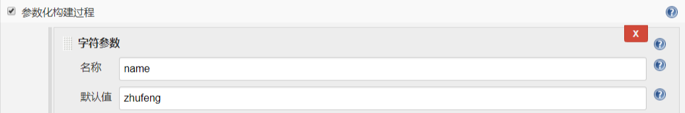
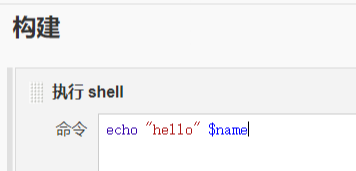
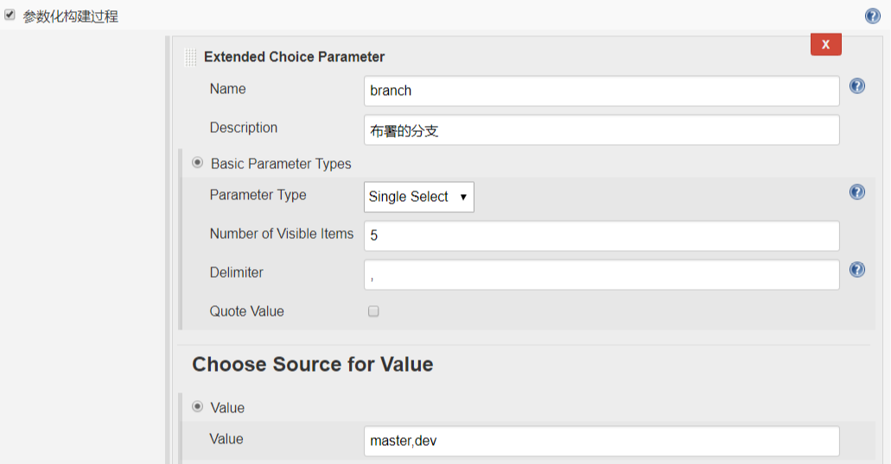
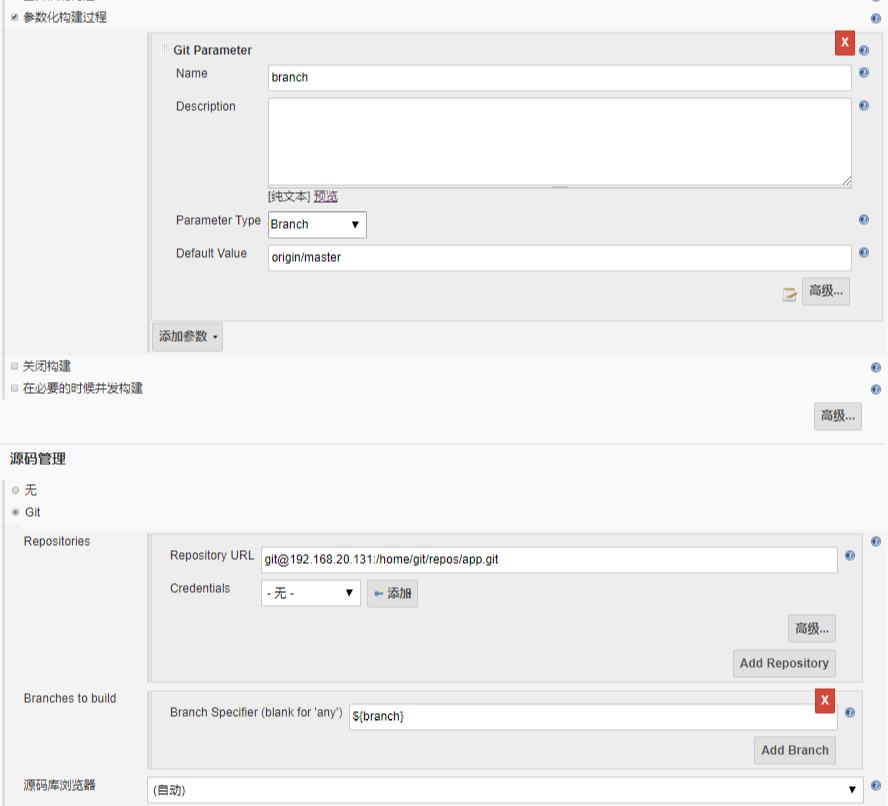

# 6.参数化构建

- Extended Choice Parameter 插件
- Git Parameter 插件
  
  
  
  

vi /etc/sysconfig/jenkins 一定要改一下 root 用户，不然流水线 SCM 拉不到脚本

```
JENKINS_USER="root"
```

```
git branch test
git checkout test
git branch
touch 5.txt
git add -A
git commit -m"add 5.txt"
git git push origin test
git push origin test
```
