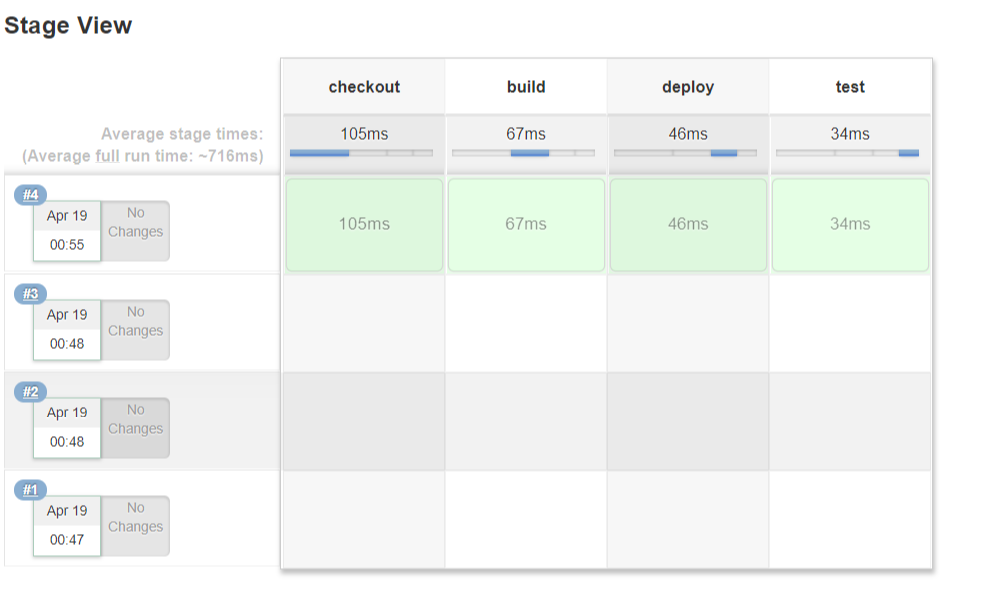
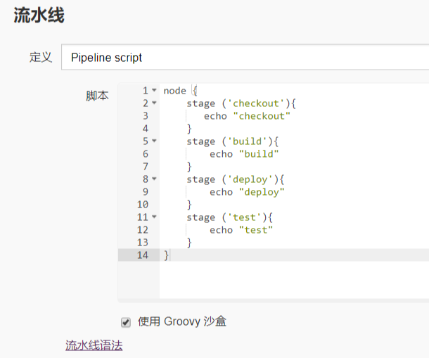
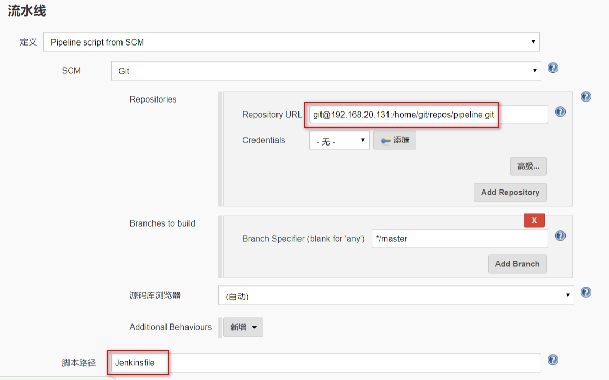

# 8.流水线

- Pipeline 插件
  
  

```
node {
    stage ('checkout'){
       echo "checkout"
    }
    stage ('build'){
        echo "build"
    }
    stage ('deploy'){
        echo "deploy"
    }
    stage ('test'){
        echo "test"
    }
}
```



```
node('slave') {
    stage ('checkout'){
       echo "checkout2"
       sleep time: 10, unit: 'SECONDS'
    }
    stage ('build'){
        echo "build"
    }
    stage ('deploy'){
        echo "deploy"
    }
    stage ('test'){
        echo "test"
    }
}
```
