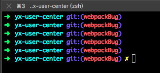
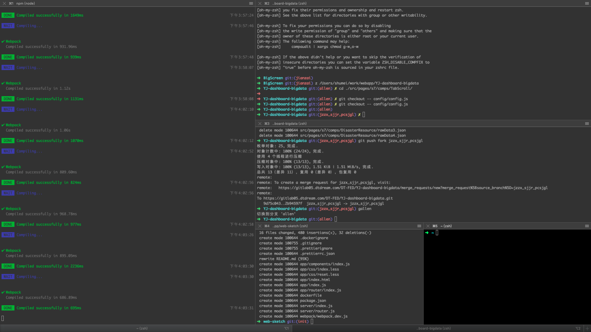
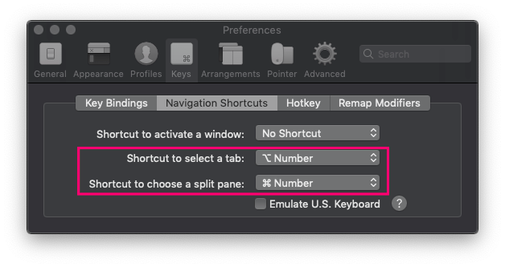
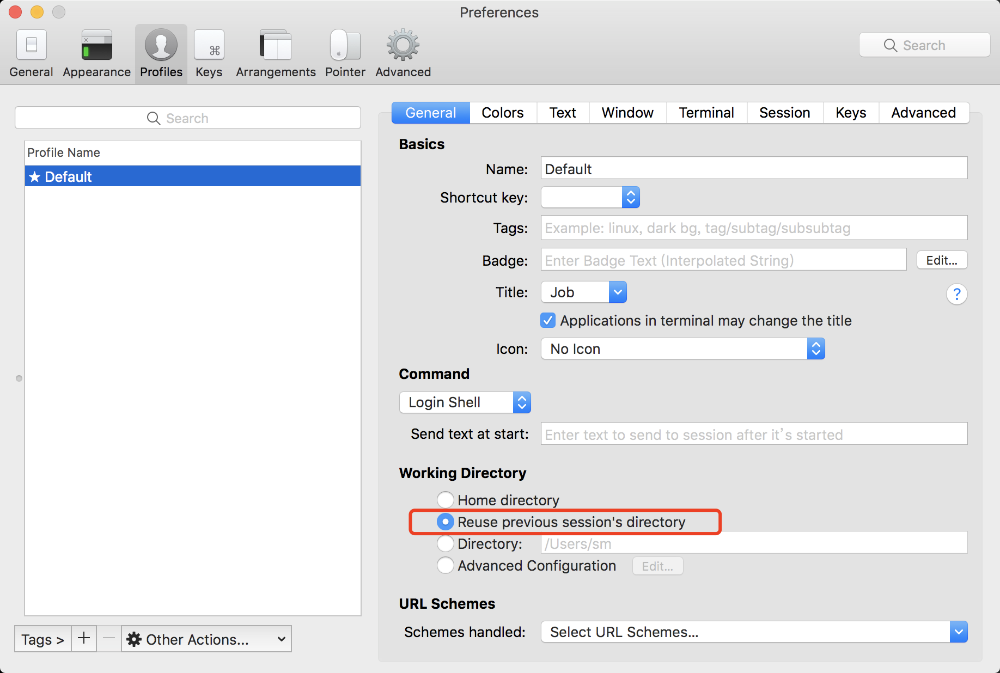

# 7.安装 iterm2（终端）
[官网下载地址](https://iterm2.com/downloads.html)

<strong>安装 zsh</strong>
mac 系统自带 zsh

<strong>安装 oh-my-zsh</strong>
官方地址被墙，无法在线安装。
离线安装方法
  - 1 下载文件: <a href="../.vuepress/public/macBook/install.sh" target="_blank">install.sh</a> 文件存放在 `.vuepress/public/macBook/install.sh`
  - 2 cd /Users/{你的用户名}/Downloads
  - 3 sh ./install.sh

安装完成后效果图


  > 参考链接: [oh-my-zsh国内镜像安装和更新方法](https://touka.dev/tech/oh-my-zsh-china-mirror/)

<strong>oh-my-zsh 使用实践</strong>
> ⌘ + d 左右分屏
> ⌘ + shift + d 上下分屏
> ⌘ + t 新开一个 tab

  


pane 和 tab 快捷键设置：⌘ + 1/2/3 选择 pane，options + 1/2/3 选择 tab
  


设置分屏后所在目录和分屏前目录相同
  


<strong>oh-my-zsh 插件</strong>
> 编辑 ~/.zshrc 文件（vi ~/.zshrc），找到 plugin 关键字就可以自定义加载插件，默认启用 git 插件：plugins=(git)

<strong>Git 插件</strong>
命令内容参考

```
cat ~/.oh-my-zsh/plugins/git/git.plugin.zsh
```
完整命令：https://github.com/ohmyzsh/ohmyzsh/tree/master/plugins/git/

<strong>z 插件</strong>
> 目录快速跳转插件。oh-my-zsh 自带此插件，默认未开启。
> 开启：plugins=(git z) 
> 命令：z。

<strong>zsh-autosuggestions 插件</strong>
输入命令时可提示自动补全（灰色部分），然后按键盘 → 即可补全。安装方法：
```
git clone git://github.com/zsh-users/zsh-autosuggestions $ZSH_CUSTOM/plugins/zsh-autosuggestions
```

<strong>oh-my-zsh 命令别名</strong>
> 用一个简短的字符来代替完整命令
>编辑 ~/.zshrc 文件，添加别名配置（alias 配置在文件末尾），如：

```
alias dks="docker ps -a"
```
改完后，重新载入配置。

<strong>oh-my-zsh 主题</strong>
> 通过如下命令可以查看可用的 theme

```
ls ~/.oh-my-zsh/themes
```

> 如何修改zsh主题呢？
> 编辑 ~/.zshrc 文件
```
ZSH_THEME="candy"
```
> 即将主题修改成 candy。改完后，记得重新载入配置 / 重启 iterm2

> 重新载入配置：
```
source ~/.zshrc
```

<strong>oh-my-zsh</strong>
> Q：运行命令时，[oh-my-zsh] 冒出一大堆提示，如何去掉？
<br/>
> A：在 .zshrc 文件的第一行添加 ZSH_DISABLE_COMPFIX=true，重新加载 .zshrc 文件。

<strong>eslint</strong>
> Q：git commit 的时候，eslint 检查未执行，即 husky 不生效
<br/>
> A：husky 是通过修改 .git/hooks 文件来实现的，所以要先有 .git，然后再安装 husky，不然会不生效。
> .git/hooks 下面的所有文件有两个版本 xxx.sample 和 xxx，就会生效。
> 解决方法：在根目录执行 npm install husky，重新安装 husky。


