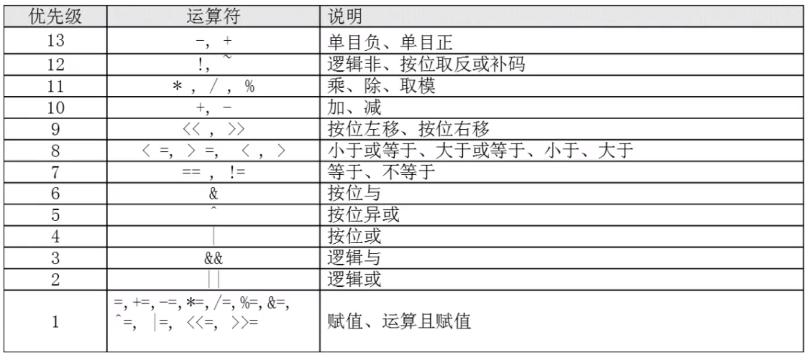

# 3.运算符

- 弱类型并且默认是字符串类型

## 3.1 declare 命令（1-5）

## 3.1.1 declare 命令

- 用来声明变量类型
- declare [+/-][选项] 变量名

| 选项 | 含义                        |
| ---- | --------------------------- |
| -    | 给变量设定类型属性          |
| +    | 取消变量的类型属性          |
| -a   | 将变量声明为数组类型        |
| -i   | 将变量声明为整数型(integer) |
| -x   | 将变量声明为环境变量        |
| -r   | 将变量声明为只读变量        |
| -p   | 显示指定变量的被声明的类型  |

```
//声明成整型
# a=1
# b=2
# c=$a+$b
# echo $c
1+2
# declare -i c=$a+$b
# echo $c
3
# declare +i c
# c=$a+$b
# echo $c
1+2
# declare -p c
declare -i c="3"

//声明环境变量
# declare -x kk=1
# bash
# set | grep kk

//只读
# declare -r x
# x=2
```

## 3.1.2 数组

```
names[0]=zhangsan
names[1]=lisi
# 声明为数组类型
declare -a names;
# 默认只打印第一个元素
echo ${names}
zhangsan
打印第2个元素
# echo ${names[1]}
lisi
# 打印全部
echo ${names[*]}
zhangsan lisi
```

## 3.1.3 声明环境变量

- export 最终执行的是`declare -x`命令
- `declare -p` 可以查看所有的类型

```
export NAME=zhufeng
declare -x NAME=zhufeng
```

## 3.1.4 只读属性

```
#declare -r gender=m
#gender=f
-bash: gender: readonly variable
```

## 3.1.5 查询变量属性

- declare -p 查询所有变量的属性
- declare -p 变量名 查询指定变量的属性

## 3.2 数值运算的方法

- 只要用 declare 声明变量的时候指定类型就可以进行数值运算

## 3.2.1 expr 或 let

- 号左右两侧必须有空格,否则还是整块输出

```
#num1=2
#num2=3
#s=$(expr $num1 + $num2)
#echo $s
5
```

```
#s=$(($num1+$num2))
#echo $s
5
#s=$[$num1+$num2]
#echo $s
5

d=$(date)
echo $d
```

## 3.2.2 优先级



```
result=$(((1+2)*4/2))
6
```
