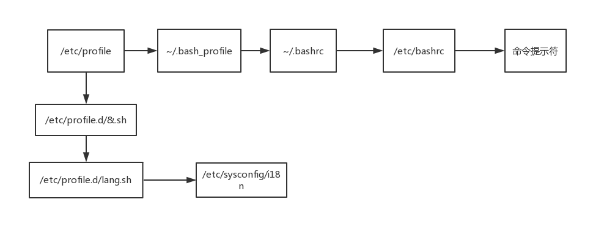

# 4.环境变量配置文件

## 4.1 source

- 修改完配置文件后，必须注销重新登录才能生效，使用 source 命令可以不用重新登录
- source 配置文件
- `. 配置文件`

## 4.2 环境变量配置文件简介

- PATH、HISTSIZE、PS1、HOSTNAME 等环境变量写入对应的环境变量配置文件
- 环境变量配置文件中主要是定义地系统操作环境生效的系统默认环境变量，如 PATH 等 此下文件登录时起作用的环境变量

| 路径                 | 说明               |
| -------------------- | ------------------ |
| /etc/profile         |                    |
| /etc/profile.d/\*.sh |                    |
| /etc/bashrc          |                    |
| ~/.bash_profile      | 只会对当前用户生效 |
| ~/.bashrc            | 只会对当前用户生效 |



## 4.3 环境变量配置文件的功能(1-5)

## 4.3.1 /etc/profile

- 在这里修改系统变量

```
cat  /etc/profile | grep USER
```

| 变量名               | 含义     |
| -------------------- | -------- |
| USER                 | 用户名   |
| LOGNAME              | 登录名   |
| MAIL                 | 邮箱地址 |
| PATH                 | 查找路径 |
| HOSTNAE              | 主机名   |
| umask                | 权限掩码 |
| /etc/profile.d/星.sh |          |

## 4.3.2 ~/.bash_profile

- PATH 在这里修改 PATH 路径
- 调用 ~/.bashrc

## 4.3.3 ~/.bashrc

- 配置 alias 改别名在这里
- 调用 /etc/bashrc

## 4.3.4 /etc/bashrc

- PS1 登录提示符在这里修改
- umask
- PATH 变量
- 调用 /etc/profile.d/星.sh 文件

## 4.3.5 其它配置文件

### 4.3.5.1 注销时生效的环境变量配置文件

~/.bash_logout

### 4.3.5.2 脚本历史

- 当正确退出计算机的时候会历史记录会写入文件 ~/.bash_history

### 4.3.5.3 Shell 登录信息

- 本地终端欢迎信息 /etc/issue 远程终端欢迎信息 /etc/issue.net 不管远程还是本地都可以生效 /etc/motd

| 参数 | 含义                         |
| ---- | ---------------------------- |
| \d   | 当前系统日期                 |
| \s   | 显示操作系统名称             |
| \l   | 显示登录的终端号             |
| \m   | 显示硬件体系结构，如 i386 等 |
| \n   | 显示主机名                   |
| \o   | 显示域名                     |
| \r   | 显示内核版本                 |
| \t   | 显示当前系统时间             |
| \u   | 显示当前登录用户的序列号     |

```
vi /etc/ssh/sshd_config
Banner /etc/issue.net
service sshd restart
```
